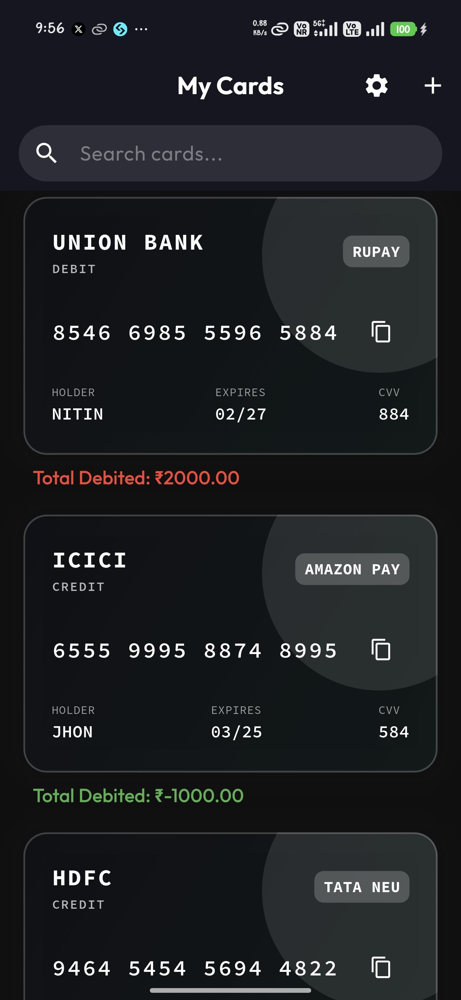
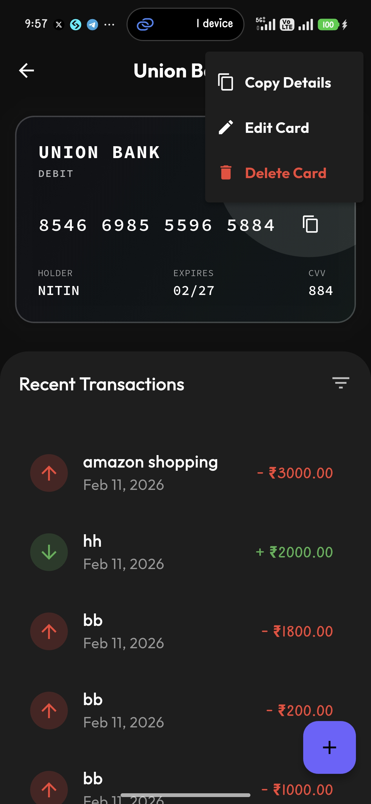
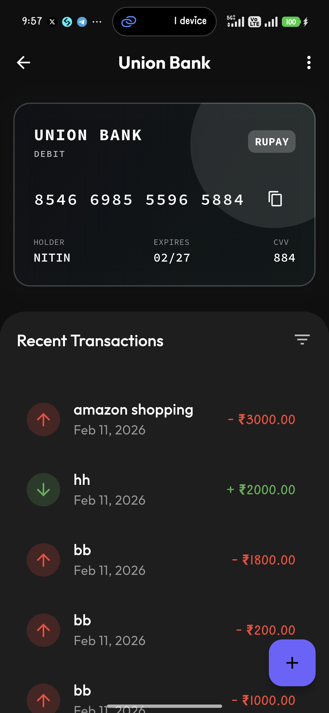
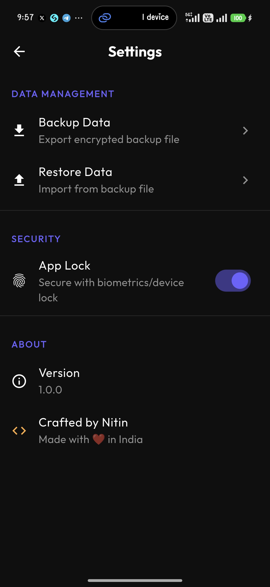

# CardVault

<div align="center">
  
</div>

<div align="center">
  <br>
  <a href="https://flutter.dev">
    
  </a>
  <a href="https://dart.dev">
    
  </a>
  <a href="https://riverpod.dev">
    
  </a>
  <a href="https://docs.hivedb.dev">
    
  </a>
  <a href="https://opensource.org/licenses/MIT">
    
  </a>
</div>

## 📖 About

**CardVault** is a premium, secure, offline-first application designed to manage your credit and debit cards with ease. Built with privacy at its core, it stores all your sensitive data locally on your device, encrypted with AES hardware-backed security.

Manage your spending with intuitive visualizations, track transactions, and secure your financial data with biometric authentication.

---

## ✨ Features

- **🔐 Bank-Grade Security**: AES-256 encryption for all sensitive data using `flutter_secure_storage` and `hive`.
- **👆 App Lock**: 
  - Biometric (Fingerprint/Face ID) & Device Credential support.
  - **Auto-Lock Timeout**: App automatically locks after 2 minutes of inactivity in the background.
- **💳 Card Management**: 
  - Add, edit, and delete cards with a beautiful, glassmorphic UI.
  - Supports Visa, MasterCard, RuPay, Amex, and more.
- **📊 Transaction Tracking**: 
  - Track debits and credits.
  - Visual indicators for **Total Debit** (Red 🔴) and **Surplus** (Green 🟢).
- **📅 Smart Date Picker**: Backdate transactions for accurate record-keeping.
- **🇮🇳 Localized**: Built-in support for Indian Rupee (₹).
- **💾 Encrypted Backup & Restore**: 
  - Export your data securely with password protection.
  - Restore your data seamlessly on any device.
- **🌓 Dark Mode**: Sleek, battery-friendly dark theme optimized for OLED displays.

---

## 📸 Screenshots

| Home Screen | Add New Card | Card Details | Add Transaction | Security Settings |
|:-----------:|:------------:|:---------------:|:-----------------:|
|  |  |  |  |  |

---

## 🛠 Tech Stack

- **Framework**: [Flutter](https://flutter.dev)
- **Language**: [Dart](https://dart.dev)
- **State Management**: [Riverpod](https://riverpod.dev)
- **Local Database**: [Hive](https://docs.hivedb.dev/) (NoSQL)
- **Encryption**: [flutter_secure_storage](https://pub.dev/packages/flutter_secure_storage) & [encrypt](https://pub.dev/packages/encrypt)
- **Biometrics**: [local_auth](https://pub.dev/packages/local_auth)
- **UI Components**: [glassmorphism_ui](https://pub.dev/packages/glassmorphism_ui), [flutter_card_swiper](https://pub.dev/packages/flutter_card_swiper)

---

## 🚀 Installation

1. **Clone the repository**
   ```bash
   git clone https://github.com/yourusername/card_vault.git
   ```

2. **Install Dependencies**
   ```bash
   cd card_vault
   flutter pub get
   ```

3. **Run the App**
   ```bash
   flutter run
   ```

---

## 📂 Folder Structure

The project follows a **Feature-First Architecture** for scalability and maintainability.

```
lib/
├── core/                   # Core functionality shared across features
│   ├── backup/             # Backup & Restore logic (Encrypted JSON)
│   ├── storage/            # Local Storage (Hive implementation)
│   ├── theme/              # App Theme & Colors
│   ├── utils/              # Utilities (Biometrics, Helpers)
│   └── widgets/            # Reusable UI widgets (AppLockWrapper)
├── features/               # Feature modules
│   ├── cards/              # Card Management (Data, Domain, Presentation)
│   ├── settings/           # Settings Screen logic
│   └── transactions/       # Transaction logic (Data, Domain, Presentation)
└── main.dart               # App Entry Point & Global Providers
```

---

## 🔒 Security

CardVault takes security seriously:

1. **Storage Encryption**: The Hive database is encrypted using a key securely stored in the platform's KeyStore (Android) or Keychain (iOS) via `flutter_secure_storage`.
2. **Backup Encryption**: Backup files (`.cvbackup`) are AES-encrypted with a user-defined password before export.
3. **App Lock**: Is implemented at the root level using `AppLockWrapper`. It monitors app lifecycle states and triggers authentication on resume (after timeout) or cold start.

---

## 👨‍💻 Author

**Nitin**  
Crafted with ❤️ in India.
